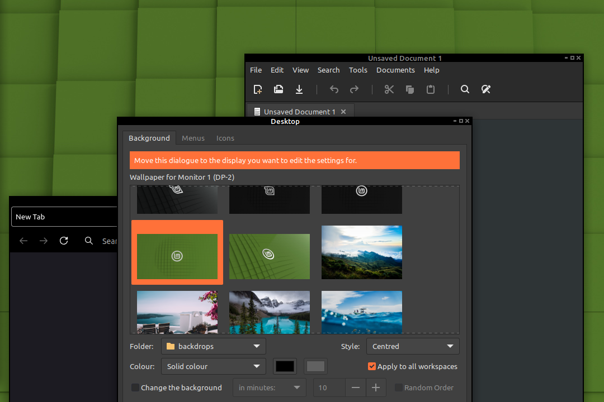

# DarkerCompact xfwm4 Theme



A version modified of [Deevad's Darkcompact_xfwm4-theme](https://github.com/Deevad/Darkcompact_xfwm4-theme), using mainly **#000000** color for top bar and #666666 for controls.
This is an **even darker**, compact and minimalistic theme for XFCE desktop ( xfm4 windows-manager ) compatible with the [Numix Archblue theme](https://github.com/cryptomaniac512/AUR-numix-themes-archblue-git).

## Installation
```
git clone https://github.com/Sskki-exe/Darkercompact_xfwm4-theme.git
sudo cp -R Darkercompact_xfwm4-theme/ /usr/share/themes/
```

Then in the user configuration, change the Window Manager theme. 

## Features
- 2px frame all around for resizing GTK3 apps without resizer grip
- Compact header , 15px height !
- Flexible layout ( you can move button, title in Windows Manager Preferences )
- No colored frame on focus with selection color. 
- Button with dark grey dimed
- #000000 everywhere ; *your content/picture is surrounded only by complete darkness*.
